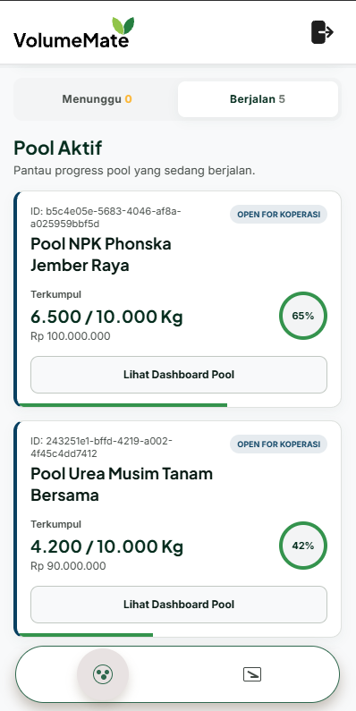
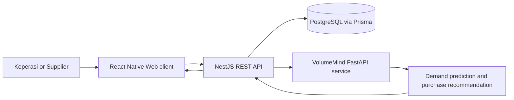

<div align="center">
  

  <h1>VolumeMate</h1>

  <h3>Cooperative procurement workflows with demand-guided planning</h3>

  <p>
    A full-stack portfolio application for agricultural cooperatives to record fertilizer activity,
    coordinate collective purchasing, and review supplier price tiers in one mobile-oriented web experience.
  </p>

  <p>
    <a href="https://github.com/LecyLecy/VolumeMate">Source Code</a>
    ·
    <a href="#run-locally">Run Locally</a>
    ·
    <a href="#limitations">Limitations</a>
  </p>
</div>

## Overview

VolumeMate is an end-to-end web application for agricultural procurement workflows. It brings together inventory activity, collective purchasing pools, supplier price tiers, audit history, and demand recommendations so a cooperative can reason about a procurement decision from one interface.

The project has three portfolio roles:

- **Admin Koperasi** records transactions, reviews dashboard information, joins collective pools, and accesses audit history.
- **Supplier** reviews proposals and active pools, then views supplier-facing audit history.
- **Admin** opens a static approval interface for the portfolio walkthrough.

The implementation separates the React Native Web client, a NestJS REST API backed by PostgreSQL through Prisma, and VolumeMind, a small FastAPI service that serves demand predictions and purchasing recommendations.

## Application Preview

<p align="center">
  
</p>

<p align="center"><em>Supplier view, showing active collective procurement pools and their current volume progress.</em></p>

## Product Experience

- Record incoming procurement and outgoing distribution activity.
- Inspect active collective buying pools and join a pool from the Koperasi flow.
- Track price tiers by product volume, including the active tier price displayed in audit history.
- Review manual and pool-based audit records, with CSV export available from the Koperasi audit screen.
- View supplier-side proposal and pool management states.
- Request a VolumeMind demand recommendation through the backend dashboard integration.
- Use a three-role local portfolio gateway to reach Koperasi, Supplier, and Admin views without entering credentials.

## How It Works



The Koperasi client records transactions and can join a collective pool. The backend persists the order and pool data, then exposes active pool and audit-log endpoints for the dashboard. For demand guidance, the backend calls VolumeMind's `/predict` and `/recommend` APIs, then returns the recommendation to the dashboard.

## Technical Architecture

### Frontend

The frontend is a Vite application built with React and React Native Web. It uses hash-based navigation in `frontend/src/App.tsx`, which keeps the app deployable as a static-style client while routing each signed-in role to the appropriate screen. Session information is stored in browser `localStorage` for the current portfolio implementation.

### Backend and data

The NestJS backend exposes REST endpoints for authentication, dashboard summaries, suppliers and price tiers, orders, collective pools, audit logs, and CSV export. Prisma maps the PostgreSQL data model for cooperatives, users, suppliers, products, price tiers, orders, pool membership, distributions, and audit records.

### VolumeMind

`VolumeMind/train.py` trains a scikit-learn `GradientBoostingRegressor` pipeline. It transforms categorical cooperative, fertilizer, and planting-season fields with one-hot encoding, then uses month, rainfall, and land-area features to predict fertilizer distribution volume. The training script uses a chronological split, evaluates test MAE and R², performs time-series cross-validation, and saves the fitted pipeline as `demand_forecasting_model.joblib`.

`VolumeMind/api.py` exposes FastAPI endpoints for prediction and recommendation. The recommendation flow compares expected demand with the available price tiers to show whether additional volume could unlock a lower price tier.

### Portfolio access decision

The login page intentionally provides one-click Koperasi and Supplier demo access through `POST /auth/demo-login`. This route issues a JWT for a matching local demo user without a password and is suitable only for a local portfolio walkthrough. It must be removed or protected by an explicit environment gate before any public deployment.

## Technology

| Area | Tools |
| --- | --- |
| Interface | React, React Native Web, Vite, TypeScript |
| API | NestJS, TypeScript |
| Data | PostgreSQL, Prisma ORM, `pg` |
| Authentication | JWT, bcryptjs |
| Demand service | Python, FastAPI, pandas, scikit-learn, joblib |
| Validation | TypeScript build, Nest build, Jest starter test |

## Repository Structure

```text
VolumeMate/
├── frontend/                   # Vite and React Native Web client
│   └── src/
│       ├── screens/            # Koperasi, Supplier, Admin, audit, pool views
│       ├── components/         # Shared UI components
│       └── services/api.ts     # Frontend API client and session handling
├── backend/                    # NestJS API
│   ├── prisma/                 # Prisma schema, migrations, portfolio data script
│   └── src/                    # Auth, dashboard, order, supplier, and AI modules
├── VolumeMind/                 # FastAPI prediction service and training assets
│   ├── api.py
│   ├── train.py
│   └── demand_forecasting_model.joblib
├── docs/                       # Project memory and README visual assets
└── README.md
```

## Run Locally

### Prerequisites

- Node.js and npm
- PostgreSQL
- Python with `pip`

### 1. Configure the backend

```bash
cd backend
npm install
cp .env.example .env
```

Set the following environment variable in `backend/.env`:

| Variable | Purpose |
| --- | --- |
| `DATABASE_URL` | PostgreSQL connection string, required |
| `PORT` | Backend port, defaults to `3000` |
| `JWT_SECRET` | JWT signing secret, recommended |
| `VOLUMEMIND_URL` | VolumeMind base URL, defaults to `http://localhost:8000` |

Apply the schema and start the API:

```bash
npx prisma migrate dev
npm run start:dev
```

For a disposable local portfolio database, populate the configured demo users with Prisma's seed command, then add the non-destructive portfolio pool and audit data:

```bash
npx prisma db seed
npm run demo:data
```

> The legacy seed clears existing data. Use it only with a disposable local database.

### 2. Start VolumeMind

```bash
cd VolumeMind
pip install fastapi uvicorn pandas joblib scikit-learn
python -m uvicorn api:app --host 127.0.0.1 --port 8000
```

### 3. Start the frontend

```bash
cd frontend
npm install
npm run dev
```

Open the local URL printed by Vite, commonly `http://127.0.0.1:5173/`. The portfolio login page provides three quick-access actions: **Admin Koperasi**, **Supplier**, and **Admin**.

## Testing and Validation

The repository currently includes a starter backend Jest suite and build scripts for both services.

```bash
# Frontend
cd frontend
npm run build

# Backend
cd backend
npm run build
npm test -- --runInBand
```

The full lint commands currently report pre-existing issues in both frontend and backend files. Treat a successful build and starter test as a basic validation step, not comprehensive integration coverage.

## Limitations

- Supplier proposals and approval interactions are primarily browser-local and are not a fully persistent multi-user workflow.
- The Admin approval page is static for the portfolio demo.
- Payment and payout lifecycle features are not implemented in the current database schema.
- The demo-login endpoint bypasses password verification and must not be exposed publicly.
- The pool target volume uses a frontend fallback in the portfolio experience because it is not stored directly in the current Prisma model.
- Test coverage is limited to a starter backend test, and existing lint debt remains.

## Future Improvements

- Replace browser-local proposal state with database models and role-protected endpoints.
- Add account approval status, document storage, and real Admin actions.
- Add product compatibility, ownership checks, and transactional handling around pool repricing.
- Gate or remove portfolio demo authentication for public deployments.
- Add API integration tests, frontend interaction tests, and model-evaluation assets that can be published with the project.

## Data, Attribution, and License

The repository includes local CSV datasets in `VolumeMind/` and a trained model artifact. An external dataset provenance or live data source is not documented in the repository.

The README logo and application screenshot are portfolio assets supplied by the project owner. No root license file is currently included, and the backend package metadata is marked `UNLICENSED`.
